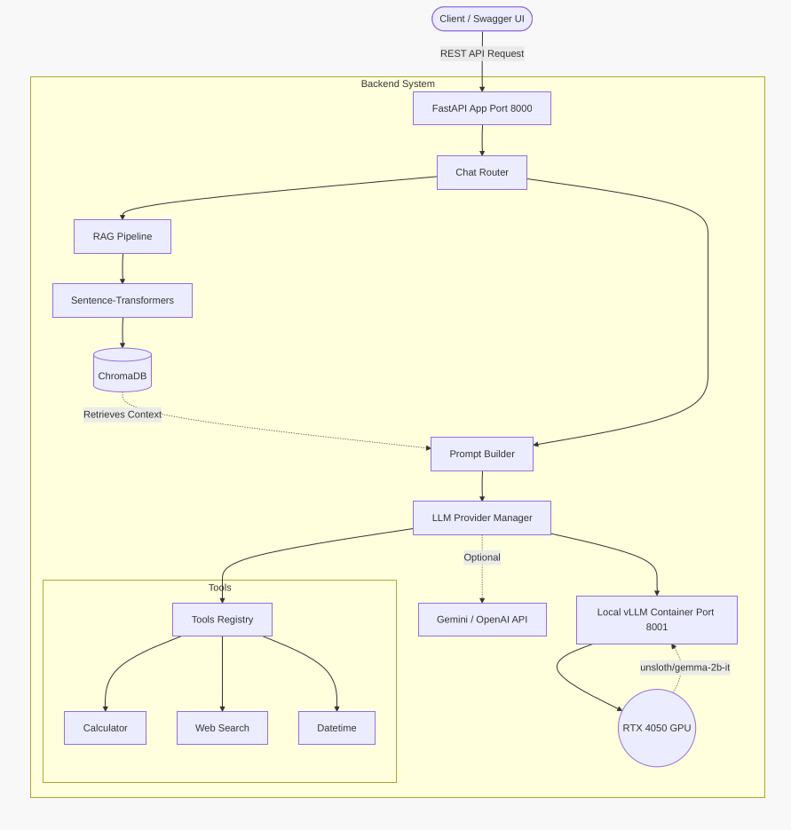
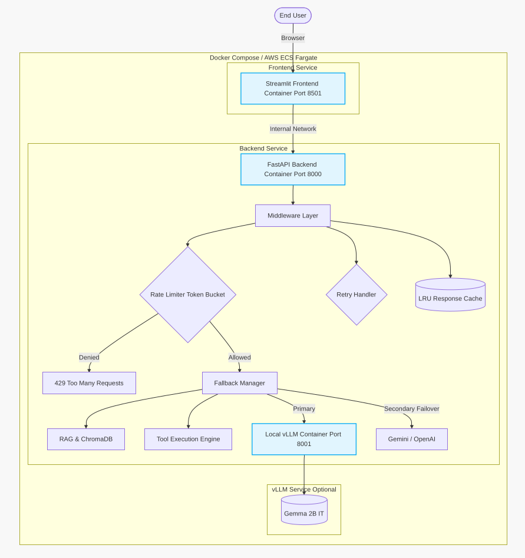

# AI Fellowship Week 15 - AI Assistant Project

This repository contains the complete implementation for the Week 15 AI Fellowship Assignment: Building and Productionizing an AI Assistant.

## 📌 Project Overview & Task Requirements
The project is divided into two main tasks:
- **Task 1 (Core AI Assistant):** Focused on the local development of a robust backend featuring Retrieval-Augmented Generation (RAG), Tool Calling (Web Search, Calculator), and integration with various LLMs (Gemini, OpenAI, vLLM).
- **Task 2 (Production Hardening & Deployment):** Focused on preparing the system for production by implementing a Streamlit frontend, Docker container orchestration, resilience middleware (caching, retries, rate limiting, fallback chains), and deployment to **Google Cloud Run**.

---

## 🏗️ Architecture Diagram

```mermaid
graph TD
    User([User]) -->|Web/Mobile| UI[Streamlit UI Port 8501]

    subgraph "Frontend Layer"
        UI
    end

    UI -->|REST API| ALB[API Gateway / Load Balancer]

    subgraph "Backend Layer (FastAPI Port 8000)"
        ALB --> RateLimit{Rate Limiter}
        RateLimit -- Allowed --> Router[API Router]
        RateLimit -- Denied --> Error429[429 Error]

        Router --> Cache{LRU Cache}
        Cache -- Hit --> Return[Return Response]
        Cache -- Miss --> RAG[RAG Pipeline]

        RAG --> Ingestion[Document Ingester]
        RAG --> Embed[Sentence-Transformers]
        Embed --> VDB[(ChromaDB)]
        VDB -.->|Context| Prompt[Prompt Builder]

        Router --> Prompt
        Prompt --> Fallback[Fallback Manager]

        Fallback -->|Primary| LLM1[Gemini API]
        Fallback -->|Secondary| LLM2[OpenAI API]
        Fallback -->|Tertiary| LLM3[Local vLLM]

        LLM1 -.-> Tools
        LLM2 -.-> Tools
        LLM3 -.-> Tools

        subgraph "Tools Registry"
            Tools[Tool Executor] --> Calc[Calculator]
            Tools --> Search[Web Search]
            Tools --> Time[Date/Time]
        End
    end
```

---

## 🚀 Design and Technology Choices
- **Backend:** FastAPI was chosen for asynchronous, high-performance API endpoints and automated OpenAPI Swagger documentation.
- **Frontend:** Streamlit allows for rapid, interactive chat UI prototyping in pure Python.
- **RAG / Vector DB:** ChromaDB using `all-MiniLM-L6-v2` embeddings for fast semantic chunk retrieval.
- **LLM Fallback Chain:**
  1. Google Gemini (Primary provider for cost-efficiency and fast inference speeds)
  2. OpenAI GPT-4o (Secondary cloud fallback)
  3. Local vLLM (Tertiary, completely offline hardware-accelerated option)
- **Resilience Middleware:** 
  - **Rate Limiting (Token Bucket):** Prevents API abuse.
  - **LRU Caching:** Caches repeated exact queries to save LLM tokens and inference latency.
  - **Exponential Backoff Retry:** Automatically retries third-party API calls on transient errors.
- **Deployment:** Containerized via Docker (two decoupled Dockerfiles), orchestrated via Docker Compose locally, and deployed as serverless containers on **Google Cloud Run**.

---

## 🛠️ Setup, Docker, and Deployment Guide

### Task 1: Local Development (Core AI Assistant)
1. Navigate to the Task 1 directory: `cd task1-ai-assistant`
2. Set up virtual environment: `python -m venv venv && source venv/bin/activate`
3. Install dependencies: `pip install -r requirements.txt`
4. Configure environment variables:
   ```bash
   cp .env.example .env
   # Open .env and add your GOOGLE_API_KEY and OPENAI_API_KEY
   ```
5. Run the FastAPI backend: `uvicorn app.main:app --reload --port 8000`

### Task 2: Production Setup (Docker Compose Local)
To test the production container orchestration locally:
1. Navigate to the Task 2 directory: `cd task2-production`
2. Ensure you have copied `.env` from Task 1 or created a new one with your keys.
3. Build and start the cluster using Docker Compose:
   ```bash
   docker-compose up --build -d
   ```
4. Access the Streamlit UI at `http://localhost:8501` and FastAPI docs at `http://localhost:8000/docs`.

### ☁️ Deployment to Google Cloud Run
The system has been successfully deployed to Google Cloud Run, creating a highly scalable, serverless architecture.

- **Live Backend API Docs:** [https://ai-assistant-backend-iwjrbkniva-el.a.run.app/docs](https://ai-assistant-backend-iwjrbkniva-el.a.run.app/docs)
- **Live Frontend UI:** [https://ai-assistant-frontend-iwjrbkniva-el.a.run.app/](https://ai-assistant-frontend-iwjrbkniva-el.a.run.app/)

**Automated Deployment Process:**
Deployment is fully scripted via `./task2-production/deploy-cloudrun.sh`. 
When executed, the script performs the following detailed process:
1. **Authentication:** Authenticates with Google Cloud and extracts your `PROJECT_ID`.
2. **Environment Variable Injection:** Reads your API keys from the local `.env` file securely.
3. **Backend Pipeline:**
   - Temporarily renames `Dockerfile.backend` to `Dockerfile` for Cloud Build compatibility.
   - Builds the Backend Docker image and pushes it to Google Container Registry (GCR).
   - Deploys the Backend to Cloud Run, injecting environment variables (`LLM_PROVIDER=gemini`, `GOOGLE_API_KEY`).
4. **Frontend Pipeline:**
   - Builds and pushes the Frontend Docker image.
   - Deploys the Frontend to Cloud Run, injecting the newly created backend URL as `BACKEND_URL`.
5. **Security Finalization:** Updates Backend CORS rules to restrict cross-origin requests to only accept traffic from the deployed Frontend URL.

---

## 📷 Coverage and Screenshots

Below are screenshots showcasing the working application interface, tool execution, and RAG capabilities:

| Interface and Outputs |
| :---: |
|  |
|  |
|  |
|  |

---

## ⚠️ Challenges Faced & Limitations

1. **API Rate Limiting & Latency:** Ensuring LLMs like Gemini or OpenAI do not exceed rate limits was a major challenge. This was solved by implementing an LRU Cache for repeated queries and an Exponential Backoff fallback strategy.
2. **Docker Compose Networking:** Getting the Streamlit frontend container to properly communicate with the FastAPI backend container required configuring an internal Docker bridge network (`ai-network`) and properly passing the `BACKEND_URL` environment variable.
3. **Cloud Run Storage Limitations:** Google Cloud Run provides an ephemeral filesystem. This means local SQLite/ChromaDB data gets wiped on container cold starts. In a fully enterprise production setup, ChromaDB should be moved to a managed Vector Database (like Pinecone) or PostgreSQL with `pgvector` to ensure persistence across serverless container lifecycles.
4. **vLLM GPU Requirements:** Running the local vLLM implementation requires a high-end NVIDIA GPU with sufficient VRAM, making it unsuitable for standard serverless deployments like Cloud Run. To fix this, cloud deployments default to the `gemini` provider through the Fallback Manager.
