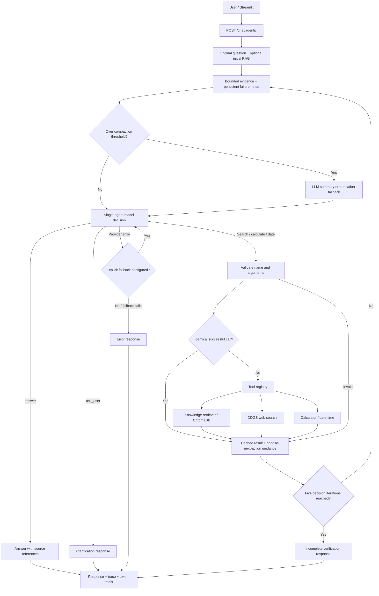

# Week 16 implementation architecture

`AgenticLoop` makes at most five decision calls plus occasional compaction calls; an explicitly injected fallback gets one attempt per failed decision. The API initializes a fresh loop for each request. Clarification ends the request; the user resubmits a question with the missing information. There is no persistent conversation/task store.

The existing W15 `/chat` path and production middleware remain separate. This diagram does not imply that agentic requests use the single-pass response cache or fallback manager. The provider identifier `local_vllm` currently selects `LocalTransformersProvider` in the factory; it does not launch a vLLM server.
