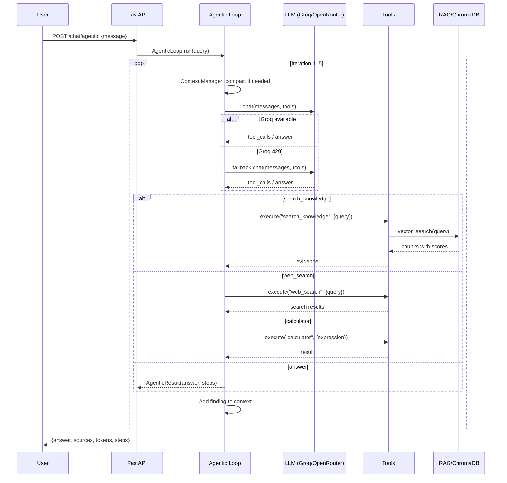
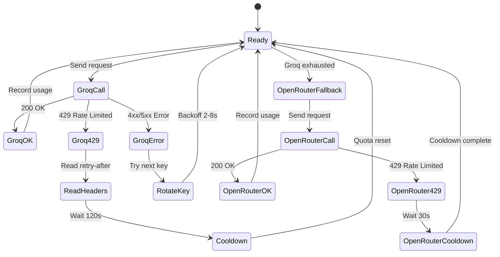

# Week 16 — Architecture Diagram

## System Architecture

```mermaid
graph TB
    subgraph User["User Layer"]
        UI[Streamlit UI]
        API[curl / HTTP Client]
    end

    subgraph Backend["FastAPI Backend"]
        FastAPI[app/main.py]
        Health[/health]
        Chat[/chat]
        Agentic[/chat/agentic]
    end

    subgraph Agent["Agentic Loop (app/agent/loop.py)"]
        Loop{Iteration 1..5}
        Decision{LLM Decision}
        Tools[Tool Execution]
        CM[Context Manager]
        Compact{Should Compact?}
        Summarize[LLM Summarizer]
    end

    subgraph LLM["LLM Providers"]
        Groq[Groq API<br/>openai/gpt-oss-20b<br/>5-key rotation]
        OpenRouter[OpenRouter API<br/>nemotron-3-super-120b:free<br/>Fallback]
    end

    subgraph Tools_Layer["Tool Registry (app/tools/registry.py)"]
        Calc[calculator]
        Web[web_search]
        DT[get_current_datetime]
        KB[search_knowledge]
    end

    subgraph RAG["RAG Pipeline"]
        Retriever[app/rag/retriever.py]
        ChromaDB[(ChromaDB)]
        Embeddings[Sentence-Transformers<br/>all-MiniLM-L6-v2]
        Chunking[Text Chunking]
        Ingestion[Document Ingestion]
    end

    subgraph Eval["Evaluation Harness"]
        Harness[app/evaluation/harness.py]
        Queries[10 Test Queries]
        Rubrics[Answer Rubrics]
        Failure[Failure Injection]
    end

    UI --> FastAPI
    API --> FastAPI
    FastAPI --> Health
    FastAPI --> Chat
    FastAPI --> Agentic
    Agentic --> Loop
    Loop --> Decision
    Decision -->|search_knowledge| KB
    Decision -->|web_search| Web
    Decision -->|calculator| Calc
    Decision -->|get_current_datetime| DT
    Decision -->|answer| Answer[Final Answer]
    Decision -->|ask_user| Clarify[Clarification]
    KB --> Retriever
    Retriever --> ChromaDB
    Retriever --> Embeddings
    Ingestion --> Chunking
    Chunking --> Embeddings
    Embeddings --> ChromaDB
    Loop --> CM
    CM --> Compact
    Compact -->|yes| Summarize
    Compact -->|no| Decision
    Summarize --> Decision
    Groq -->|primary| Decision
    OpenRouter -->|fallback| Decision
    Harness --> Queries
    Harness --> Rubrics
    Harness --> Failure
```

## Data Flow Diagram



## Rate Limit Flow



## Component Architecture

```
┌─────────────────────────────────────────────────────────────┐
│                    Application Layer                         │
├─────────────────────────────────────────────────────────────┤
│  main.py (FastAPI)                                          │
│  ├── /chat/agentic → AgenticLoop                            │
│  ├── /chat → Direct LLM call                                │
│  └── /documents/* → RAG pipeline                            │
├─────────────────────────────────────────────────────────────┤
│                    Agent Layer                               │
├─────────────────────────────────────────────────────────────┤
│  loop.py (AgenticLoop)                                      │
│  ├── Provider selection (Groq → OpenRouter)                  │
│  ├── Tool decision (model-directed)                         │
│  ├── Evidence accumulation                                  │
│  └── Stopping conditions                                    │
│                                                             │
│  context_manager.py (ContextManager)                        │
│  ├── Evidence bounding (3000 chars/item)                     │
│  ├── Compaction (6000 chars threshold)                      │
│  └── LLM summarizer with fallback                           │
├─────────────────────────────────────────────────────────────┤
│                    Provider Layer                            │
├─────────────────────────────────────────────────────────────┤
│  groq.py (GroqProvider)                                     │
│  ├── 5-key rotation                                         │
│  ├── Exponential backoff (2s/4s/8s)                         │
│  ├── Token-aware pacing                                     │
│  └── retry-after header parsing                             │
│                                                             │
│  openrouter.py (OpenRouterProvider)                         │
│  ├── Free-tier model routing                                │
│  ├── 30s minimum interval                                   │
│  └── Tool calling with text fallback                        │
├─────────────────────────────────────────────────────────────┤
│                    Tool Layer                                │
├─────────────────────────────────────────────────────────────┤
│  registry.py (ToolRegistry)                                 │
│  ├── Tool registration and validation                       │
│  ├── Argument validation                                    │
│  └── Async execution                                        │
│                                                             │
│  Tools: calculator, web_search, datetime, knowledge_search  │
├─────────────────────────────────────────────────────────────┤
│                    RAG Layer                                 │
├─────────────────────────────────────────────────────────────┤
│  retriever.py (RAGRetriever)                                │
│  ├── ChromaDB vector store                                  │
│  ├── Sentence-Transformers embeddings                       │
│  └── Similarity search with scoring                         │
│                                                             │
│  ingestion.py → chunking.py → embeddings.py                 │
├─────────────────────────────────────────────────────────────┤
│                    Evaluation Layer                          │
├─────────────────────────────────────────────────────────────┤
│  harness.py (EvaluationHarness)                             │
│  ├── Query execution and measurement                        │
│  ├── Rubric-based scoring                                   │
│  └── Report generation                                      │
│                                                             │
│  test_queries.py, failure_injection.py                      │
└─────────────────────────────────────────────────────────────┘
```
